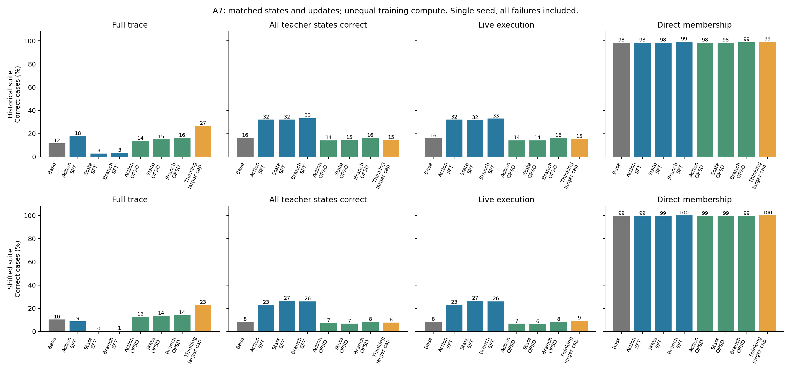
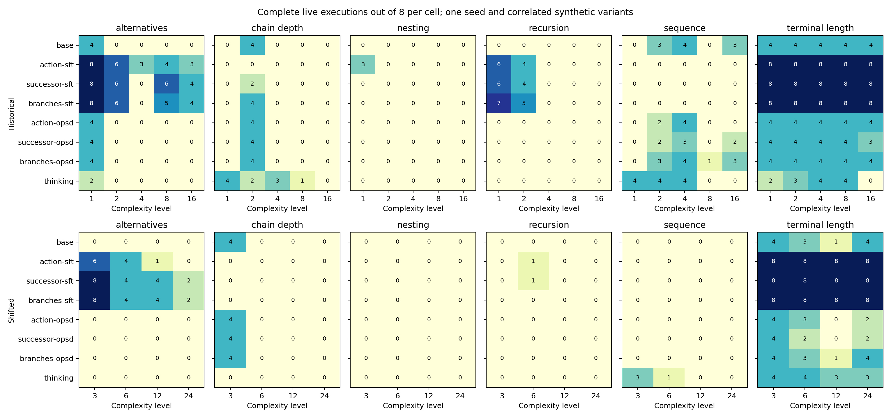
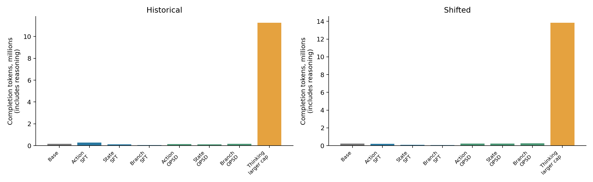

# A7: richer supervision, distillation, and test-time reasoning

All eight planned conditions are complete and their saved calls have been replayed through the strict grader.

This is a small AbstractGym adaptation of [SPSD](https://arxiv.org/abs/2609.30936), not a reproduction of its games, expert search, or training settings. The main question is whether verified successor states and short alternative-branch traces help Qwen3-14B learn a more reliable execution step than action labels alone. A separate untrained control tests a larger thinking budget.

## Results with every failure retained

“Teacher states” means every gold-state action is correct for that case. “Live” means the model completes the entire canonical DFS using externally maintained state, stopping at the first error. These are stricter than average action accuracy. Direct membership is a binary answer, not an execution trace.

### Original 240-case suite

| Condition | Full trace | All teacher states | Live execution | Direct membership |
| --- | --- | --- | --- | --- |
| base | 28/240 (11.7%) | 39/240 (16.2%) | 38/240 (15.8%) | 236/240 (98.3%) |
| action-sft | 43/240 (17.9%) | 77/240 (32.1%) | 77/240 (32.1%) | 236/240 (98.3%) |
| successor-sft | 7/240 (2.9%) | 77/240 (32.1%) | 76/240 (31.7%) | 236/240 (98.3%) |
| branches-sft | 8/240 (3.3%) | 80/240 (33.3%) | 79/240 (32.9%) | 238/240 (99.2%) |
| action-opsd | 33/240 (13.8%) | 34/240 (14.2%) | 34/240 (14.2%) | 236/240 (98.3%) |
| successor-opsd | 36/240 (15.0%) | 35/240 (14.6%) | 34/240 (14.2%) | 236/240 (98.3%) |
| branches-opsd | 39/240 (16.2%) | 39/240 (16.2%) | 39/240 (16.2%) | 237/240 (98.8%) |
| thinking | 64/240 (26.7%) | 35/240 (14.6%) | 37/240 (15.4%) | 238/240 (99.2%) |

### New 192-case suite: depths and symbol names changed together

| Condition | Full trace | All teacher states | Live execution | Direct membership |
| --- | --- | --- | --- | --- |
| base | 20/192 (10.4%) | 16/192 (8.3%) | 16/192 (8.3%) | 191/192 (99.5%) |
| action-sft | 17/192 (8.9%) | 44/192 (22.9%) | 44/192 (22.9%) | 191/192 (99.5%) |
| successor-sft | 0/192 (0.0%) | 51/192 (26.6%) | 51/192 (26.6%) | 191/192 (99.5%) |
| branches-sft | 1/192 (0.5%) | 50/192 (26.0%) | 50/192 (26.0%) | 192/192 (100.0%) |
| action-opsd | 24/192 (12.5%) | 14/192 (7.3%) | 13/192 (6.8%) | 191/192 (99.5%) |
| successor-opsd | 26/192 (13.5%) | 13/192 (6.8%) | 12/192 (6.2%) | 191/192 (99.5%) |
| branches-opsd | 27/192 (14.1%) | 16/192 (8.3%) | 16/192 (8.3%) | 191/192 (99.5%) |
| thinking | 44/192 (22.9%) | 15/192 (7.8%) | 18/192 (9.4%) | 192/192 (100.0%) |

## What the controlled comparisons say

Action-only SFT completes 77/240 (32.1%) original-suite live cases versus 38/240 (15.8%) for the base. On the shifted suite the corresponding results are 44/192 (22.9%) and 16/192 (8.3%).

SFT richer-supervision changes in completed live cases relative to its matched action-only control: historical: successor -1, branches +2; shifted: successor +7, branches +6. These are finite-suite differences at the shared fixed update budget, not equal-compute or optimal-hyperparameter comparisons.

OPSD richer-supervision changes in completed live cases relative to its matched action-only control: historical: successor +0, branches +5; shifted: successor -1, branches +3. These are finite-suite differences at the shared fixed update budget, not equal-compute or optimal-hyperparameter comparisons.

For action-only training, SFT versus distillation gives 77/240 (32.1%) versus 34/240 (14.2%) on the original suite, and 44/192 (22.9%) versus 13/192 (6.8%) on the shifted suite. The distillation teacher is a frozen LLM conditioned on the verified answer; it is not the symbolic oracle itself.

The larger-budget thinking control achieves 37/240 (15.4%) original and 18/192 (9.4%) shifted live executions. It changes both thinking mode and output/context budgets relative to the fresh base. Relative to historical X10, it is an expanded-budget control with the task wording preserved, not an optimized decoding recipe.

The strongest live SFT result is 79/240 on the original suite (branches) and 51/192 on the shifted suite (successor). Against action-only SFT, richer evidence changes original live completion by only −1 or +2 cases, and shifted completion by +7 or +6 cases. These are modest descriptive gains; this pilot does not establish that search evidence is the cause or that the difference generalizes.

The richer SFT arms also lose full-trace reliability: successor scores 7/240 original and 0/192 shifted cases, and branches scores 8/240 and 1/192, versus action-only SFT at 43/240 and 17/192. Most failures are incomplete traces. Better single-step behavior therefore does not transfer automatically to emitting a complete execution in one response.

All three distillation arms remain below the corresponding SFT live scores. Branch distillation reaches 39/240 and 16/192, close to the untrained base at 38/240 and 16/192. This is a negative result for this specific frozen-teacher, one-epoch recipe, not evidence against distillation or SPSD in general.

Thinking raises full-trace completion from 28 to 64/240 and from 20 to 44/192, but live completion changes from 38 to 37/240 and from 16 to 18/192. It consumes about 149×/148× as many live completion tokens as base on the original/shifted suites. Even the expanded step budget leaves 49 original-suite and 50 shifted-suite live cases with truncated, unparseable calls. Thus this run neither demonstrates reliable execution from more thinking nor rules out gains with other budgets or decoding.

A higher teacher-state token or action score does not guarantee a completed program: errors can move to previously reliable cases, and one wrong action ends a live run. The following operation and complexity breakdowns show which components remain unreliable. Perfect BT scores here can reflect learning the explicit await_bt phase-to-action mapping; state mutation is still supplied by the harness, and this does not establish a general backtracking algorithm.

## Components and increasing complexity

### Historical teacher-action correctness

| Condition | ACC | BT | DONE | PRN | TRY |
| --- | --- | --- | --- | --- | --- |
| base | 103/120 | 115/1008 | 20/492 | 179/636 | 983/1604 |
| action-sft | 102/120 | 1008/1008 | 393/492 | 566/636 | 1228/1604 |
| successor-sft | 98/120 | 1008/1008 | 394/492 | 585/636 | 1265/1604 |
| branches-sft | 96/120 | 1008/1008 | 392/492 | 589/636 | 1213/1604 |
| action-opsd | 107/120 | 183/1008 | 22/492 | 297/636 | 1030/1604 |
| successor-opsd | 113/120 | 268/1008 | 14/492 | 251/636 | 1012/1604 |
| branches-opsd | 112/120 | 267/1008 | 16/492 | 204/636 | 1030/1604 |
| thinking | 112/120 | 246/1008 | 123/492 | 255/636 | 1230/1604 |

### Shifted teacher-action correctness

| Condition | ACC | BT | DONE | PRN | TRY |
| --- | --- | --- | --- | --- | --- |
| base | 82/96 | 48/1372 | 16/636 | 349/832 | 1239/2172 |
| action-sft | 81/96 | 1372/1372 | 468/636 | 787/832 | 1638/2172 |
| successor-sft | 79/96 | 1372/1372 | 472/636 | 790/832 | 1782/2172 |
| branches-sft | 79/96 | 1372/1372 | 472/636 | 791/832 | 1710/2172 |
| action-opsd | 82/96 | 133/1372 | 18/636 | 532/832 | 1260/2172 |
| successor-opsd | 84/96 | 230/1372 | 7/636 | 462/832 | 1270/2172 |
| branches-opsd | 84/96 | 220/1372 | 12/636 | 414/832 | 1283/2172 |
| thinking | 90/96 | 321/1372 | 180/636 | 371/832 | 1564/2172 |

### Live execution failure audit

| Condition | Original wrong action | Original parse/truncation | Shifted wrong action | Shifted parse/truncation |
| --- | --- | --- | --- | --- |
| base | 202 | 0 | 176 | 0 |
| action-sft | 163 | 0 | 148 | 0 |
| successor-sft | 164 | 0 | 141 | 0 |
| branches-sft | 161 | 0 | 142 | 0 |
| action-opsd | 206 | 0 | 179 | 0 |
| successor-opsd | 206 | 0 | 180 | 0 |
| branches-opsd | 201 | 0 | 176 | 0 |
| thinking | 154 | 49 | 124 | 50 |

Every failed case stays in the denominator. Non-thinking live failures are semantic next-action errors with valid JSON; thinking adds truncated outputs. No tool outages or recovery interventions were injected, so tool-failure robustness is untested.

All three SFT arms complete all 40 original and all 32 shifted terminal-length cases. However, shifted nesting, chain-depth, and sequence cases all remain at zero live successes for these arms. The aggregate gain is narrow: the richer-target shifted gain is concentrated in the alternatives family, not broad algorithmic generalization.

Each cell contains eight cases, with correlated synthetic variants. Counts are descriptive; I do not treat them as independent draws or claim statistical significance from this one-seed pilot. Paired improvements and regressions are available in [paired_changes.json](results/a7/paired_changes.json).

## Training and inference cost

All six training arms use 512 frozen starting states (eight from each of 64 training trajectories), 1,024 rows, one epoch, and 128 optimizer updates. Action-only repeats each action row; richer arms replace the second standalone action row with a separate auxiliary task. Equal row weighting also dilutes action-token weight in long auxiliary targets. Longer outputs, rollout generation, and teacher scoring make compute unequal. Starting observations are matched; auxiliary targets necessarily expose additional successor or branch states. This does not hold total state information fixed.

| Condition | Training min | Student processed M tokens | Teacher scored M tokens | Rollout generated k tokens | Run min |
| --- | --- | --- | --- | --- | --- |
| base | — | — | — | — | 10.8 |
| action-sft | 4.9 | 0.817 | 0.000 | 0.0 | 26.3 |
| successor-sft | 5.6 | 0.991 | 0.000 | 0.0 | 19.8 |
| branches-sft | 5.8 | 1.081 | 0.000 | 0.0 | 12.8 |
| action-opsd | 7.8 | 0.819 | 0.856 | 10.4 | 24.6 |
| successor-opsd | 47.9 | 1.014 | 1.222 | 202.1 | 65.0 |
| branches-opsd | 95.3 | 1.245 | 1.503 | 392.8 | 113.5 |
| thinking | — | — | — | — | 306.6 |

Run wall time includes training, evaluation, model setup within the job, and artifact writes; it excludes Ray provisioning before the runner starts. Token counts are workload measurements, not FLOP estimates. Each model job requests one B200. Native LoRA is used throughout; all inference conditions enable the same LoRA engine.

Inference totals include all four interfaces, successful and failed calls, and thinking tokens. A stronger live policy can use more calls because it executes farther before failing.

## Frozen design and validation

Base: `Qwen/Qwen3-14B`, revision `40c069824f4251a91eefaf281ebe4c544efd3e18`. Seed 17; ordinary LoRA rank 16, alpha 32, dropout 0, seven attention/MLP projection targets, 64,225,280 trainable parameters; BF16 base and FP32 adapters. AdamW uses learning rate 5e-5, weight decay .01, cosine decay, 5% warmup, gradient clipping 1, microbatch 1 and effective batch 8. No held-out checkpoint or hyperparameter selection occurs.

SFT uses response-only cross entropy. Distillation uses full-vocabulary forward KL from a detached, frozen original-base teacher on the student’s sampled token prefixes. Its privileged prompt contains the verified reference. Student sampling uses temperature 1, top-p .95, and caps of 128 action or 1,024 auxiliary tokens. Both networks have thinking off. Malformed and truncated training rollouts remain included. These objective and teacher choices are explicit differences from SPSD. The comparison changes both the loss and the target distribution (verified hard labels versus an LLM teacher’s soft probabilities), so it is a training-method comparison, not a loss-only ablation.

Inference is greedy, with unchanged task prompts and batches of at most 32. Standard full/step/direct caps are 4,096/128/128 tokens with context 16,384. Thinking uses 16,384/4,096/8,192 with context 32,768. The harness offers no correction, repair, retries, candidate actions, or privileged branch evidence. Complete raw calls are replayed through the original strict grader.

The original suite was already observed in earlier work. The new set combines levels 3, 6, 12, 24 with renamed terminals and nonterminals; it has the same six grammar families. It does not isolate depth from renaming or test arbitrary unseen CFG families. Binary membership can exploit regularities of these diagnostic families; a high score does not demonstrate a general parser.

The branch targets contain only up to three continuation steps. Across 237 branch traces, 144 remain unresolved, 91 fail, and two accept; 105 training states have two alternatives. Alternative expansions are grammar-legal counterfactuals, not valid canonical next actions. This is much weaker evidence than a strong expert’s long search traces.

Development-only smoke runs caught a reload-probe mismatch: native and reloaded models used different cache settings. With both set to `use_cache=False`, every saved/reloaded parameter and probe logit matched exactly for both objectives. Tolerances and training budgets were unchanged; failed smoke checkpoints were discarded.

The earlier X7 DFS run used 11,002 states, three epochs, and 1,032 updates with a different batch size and learning rate. Its 133/240 live result is historical context, not this pilot’s matched action-only control.

## What remains unknown

- Whether the conclusions persist across seeds, training budgets, learning rates, and genuinely unseen algorithm families.
- Whether longer or better expert branch evidence helps, with controls for target length, action weighting, and total compute.
- How much the frozen evidence-conditioned teacher actually improves the target distribution, versus merely making the student match its existing errors.
- Which failures are depth sensitivity, symbol binding, state tracking, or output-protocol transfer; the current shifted set combines several changes.
- Whether retries, verification-guided search, learned recovery, or a symbolic executor can turn imperfect local policies into reliable execution. Those interventions are not tested here.

These experiments measure finite, bounded execution reliability. They do not establish or refute Turing completeness, arbitrary-program execution, or mechanistic claims about which circuits implement the step.

## Reproducibility

All 16 condition/suite raw-call sets were replayed through the strict grader, and the tests in this repository pin the reported numbers. The three result figures were visually inspected. A post-hoc teacher-distribution diagnostic was planned but not run; no teacher-quality conclusion relies on it.

The [frozen protocol](a7_protocol.md), [data and hashes](../experiments/a7/manifest.json), [comparison JSON](results/a7/comparison.json), and per-condition metadata and summaries accompany this report. The six trained adapters are on Hugging Face: [flavianv/abstractgym-a7-arms](https://huggingface.co/flavianv/abstractgym-a7-arms).
